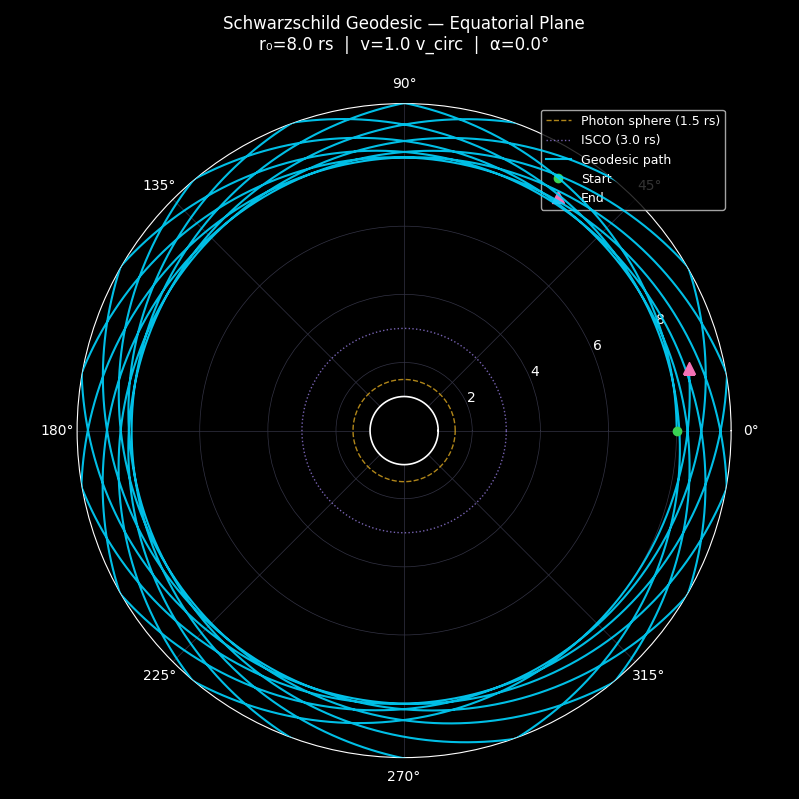

# Schwarzschild Geodesic Explorer

Integrate and visualize particle trajectories in Schwarzschild spacetime.
Explore stable orbits, relativistic precession, photon-sphere grazing, and black hole plunges.



> [!NOTE]  
> Related project: [numerical_resolution_geodesic_eq](https://github.com/Condorbox/numerical_resolution_geodesic_eq)
---

## Contents

- [Overview](#overview)
- [Features](#features)
- [Requirements](#requirements)
- [Installation](#installation)
- [Quick Start](#quick-start)
- [Usage](#usage)
  - [Commands](#commands)
  - [Presets](#presets)
  - [Parameters](#parameters)
  - [Examples](#examples)
- [Interfaces](#interfaces)
  - [CLI](#cli)
  - [Desktop GUI](#desktop-gui)
- [Physics Notes](#physics-notes)
- [Repository Layout](#repository-layout)
- [Running Tests](#running-tests)
- [Troubleshooting](#troubleshooting)

---

## Overview

The **Schwarzschild Geodesic Explorer** is a Python tool for studying test-particle motion in the Schwarzschild spacetime. It makes it easy to explore initial conditions, radius, launch angle, speed and immediately see the result: a stable circular orbit, relativistic precession, an escape trajectory, or a plunge into the black hole.

Three integrators are available (RK4, RK45, DOP853), and results can be rendered as a 2D polar plot, a 3D perspective view, or a phase-space portrait. A full Tkinter desktop GUI is included alongside the CLI.

---

## Features

| Category        | Details                                                              |
|-----------------|----------------------------------------------------------------------|
| **Presets**     | 5 built-in named scenarios; all parameters overridable via flags     |
| **Integrators** | Fixed-step **RK4**, adaptive **RK45** and **DOP853** (via SciPy)     |
| **2D renderer** | Polar plot with event horizon, photon sphere, and ISCO overlays      |
| **3D renderer** | Perspective plot with adjustable orbital-plane inclination           |
| **Phase space** | r vs ṙ = dr/dτ portrait with colour-coded proper-time progression    |
| **Desktop GUI** | Tkinter app with live sliders, stat cards, and a computing overlay   |
| **Headless**    | `--save PATH` flag (or `MPLBACKEND=Agg`) for CI / remote rendering   |
| **Test suite**  | Pytest unit + integration tests covering physics, solver, and config |

---

## Requirements

- Python **3.10+**
- [`numpy`](https://numpy.org/)
- [`scipy`](https://scipy.org/)
- [`matplotlib`](https://matplotlib.org/)
- [`pytest`](https://docs.pytest.org/en/stable/)


> [!IMPORTANT]  
> The desktop GUI requires **Tkinter**, which ships with most Python distributions. No additional packages are needed for the CLI or headless rendering.

---

## Installation

```bash
# 1. Clone the repository
git clone <repo-url>
cd schwarzschild-geodesic-explorer

# 2. Create and activate a virtual environment
python -m venv .venv
source .venv/bin/activate      # Windows: .venv\Scripts\activate

# 3. Install dependencies
pip install -U pip
pip install numpy scipy matplotlib
```

---

## Quick Start

```bash
# List all built-in presets
python main.py presets

# Run and plot a stable circular orbit
python main.py run --preset circular

# Save a precessing petal orbit to a file (no window needed)
python main.py run --preset petal --save petal.png

# Launch the interactive desktop GUI
python main.py ui
```

---

## Usage

```
python main.py <command> [options]
```

### Commands

| Command   | Description                                          |
|-----------|------------------------------------------------------|
| `presets` | List all built-in presets with descriptions          |
| `run`     | Integrate a geodesic and display (or save) the plot  |
| `info`    | Integrate and print statistics only — no plot window |
| `ui`      | Launch the interactive Tkinter desktop GUI           |

---

### Presets

Each preset is a fully-specified combination of initial conditions and solver settings. Presets can be used as-is or as a base for manual overrides.

| Name         | Description                                                 |
|--------------|-------------------------------------------------------------|
| `circular`   | Stable circular orbit at 8 rs                               |
| `elliptical` | Elliptical orbit (periapsis ≈ 5 rs) with GR precession      |
| `escape`     | Escape trajectory — speed exceeds local circular velocity   |
| `petal`      | Precessing petal orbit far from the black hole (r₀ = 40 rs) |
| `plunge`     | Low-angular-momentum plunge into the black hole             |

---

### Parameters

Manual flags always win over preset values, so you can mix and match freely.

| Flag                | Default | Description                                                      |
|---------------------|---------|------------------------------------------------------------------|
| `--preset NAME`     | —       | Base preset (case-insensitive)                                   |
| `--r0 RS`           | 8.0     | Initial radius in units of rs; must be `> 1.5`                   |
| `--speed FRAC`      | 1.0     | Speed as a fraction of local circular orbit speed (≥ 0)          |
| `--angle DEG`       | 0.0     | Launch angle in degrees: `0` = tangential, `90` = radial outward |
| `--tau-max TAU`     | 10000   | Proper time to integrate (`> 0`)                                 |
| `--step-size H`     | 1.0     | RK4 step size or `solve_ivp(max_step=…)` hint (`> 0`)            |
| `--solver`          | DOP853  | Integrator: `RK4`, `RK45`, or `DOP853`                           |
| `--save PATH`       | —       | *(run only)* Save figure to file instead of displaying it        |
| `--3d`              | off     | *(run only)* Render a 3D perspective plot                        |
| `--inclination DEG` | 30.0    | *(run only)* Orbital-plane tilt for the 3D view                  |

---

### Examples

```bash
# List available presets
python main.py presets

# Plot the elliptical preset
python main.py run --preset elliptical

# Override the starting radius, keep everything else from the preset
python main.py run --preset elliptical --r0 12

# Render a 3D view with a steeper inclination angle
python main.py run --preset petal --3d --inclination 45

# Headless render to PNG (no display required)
python main.py run --preset plunge --save plunge.png

# Print integration statistics without opening a plot window
python main.py info --preset circular

# Manual parameters from scratch — no preset
python main.py run --r0 6.5 --speed 0.7 --angle 20 --tau-max 2000 --solver RK4
```

---

## Interfaces

### CLI

The command-line interface is the primary entry point. Every parameter is a flag; presets are optional shortcuts. Results can be rendered to screen or saved headlessly.

```
python main.py run --preset circular
```

### Desktop GUI

The Tkinter GUI (`python main.py ui`) provides an interactive environment with:

- **Preset buttons:** one-click orbit selection
- **Parameter sliders:** real-time adjustment of r₀, speed, angle, τ
- **Integrator toggle:** switch between RK4 / RK45 / DOP853
- **Log-scale step-size slider:** spans 0.01 to 10 ergonomically
- **Three view tabs:** 2D polar orbit, 3D perspective, phase-space portrait
- **Live stat cards:** step count, r min/max, status, wall-clock time
- **Computing overlay:** animated indicator while the solver runs in the background

---

## Physics Notes

The simulation uses geometric units throughout.

| Constant                 | Value  |
|--------------------------|--------|
| Speed of light c         | 1      |
| Gravitational constant G | 1      |
| Black hole mass M        | 1      |
| Schwarzschild radius rs  | 2M = 2 |

Radii are reported and plotted in **units of rs**.

| Feature                                | Radius     |
|----------------------------------------|------------|
| Event horizon                          | r = 1 rs   |
| Photon sphere                          | r = 1.5 rs |
| ISCO (innermost stable circular orbit) | r = 3 rs   |

**Angular momentum conservation:** L = r² dφ/dτ is an exact first integral of the equations of motion. The test suite verifies it is conserved to better than 1 part in 10^7 over long integrations.

**GR periapsis precession:** Bound orbits precess, the azimuthal gap between consecutive periapses exceeds 2π. This is a genuine general-relativistic effect absent from Newtonian gravity, and is tested explicitly in `tests/test_physics.py`.

**Horizon freeze:** When a trajectory reaches r ≤ 1.005 rs, the right-hand side of the ODE is frozen to zero to prevent coordinate-singularity blow-up. The `Solution.plunged` property reports `True` when the final radius is at or below 1.02 rs.

---

## Repository Layout

```
.
├── main.py                  Entry point
├── cli.py                   argparse command-line interface
│
├── core/
│   ├── config.py            OrbitalParams, SolverConfig, Solution dataclasses
│   ├── physics.py           Schwarzschild helpers + geodesic ODE RHS
│   ├── presets.py           Built-in named preset registry
│   └── solver.py            RK4 + SciPy-based integrators
│
├── render/
│   ├── _base.py             Shared save/show logic and title builder
│   ├── plot2d.py            2D polar Matplotlib renderer
│   ├── plot3d.py            3D perspective Matplotlib renderer
│   └── style.py             Colour and font constants
│
├── ui/
│   ├── app.py               Main Tkinter application window
│   ├── control_panel.py     Left sidebar (presets, sliders, run button)
│   ├── view_panel.py        Right panel (2D canvas, 3D view, phase space, stats)
│   └── widgets.py           Reusable widget primitives
│
└── tests/
    ├── conftest.py           Shared pytest fixtures
    ├── test_config.py        OrbitalParams / SolverConfig / presets unit tests
    ├── test_physics.py       Physics correctness and GR behaviour tests
    ├── test_solver.py        Solver integration and agreement tests
    └── test_presets_integration.py  End-to-end preset pipeline tests
```

---

## Running Tests

```bash
pip install pytest
pytest
```

The test suite covers:

- **Config validation:** boundary conditions for all parameters.
- **Physics:** lapse function, horizon freeze, angular momentum conservation, GR precession, circular orbit stability.
- **Solver:** output structure, plunge detection, RK4 / RK45 / DOP853 agreement, step-count formula.
- **End-to-end presets:** each preset is run through the full pipeline and its physical outcome verified.

---

## Troubleshooting

**No plot window appears**
Use `--save output.png`, or set the backend explicitly before running:

Linux / macOS
```bash
MPLBACKEND=Agg python main.py run --preset circular --save orbit.png
```
Windows CMD
```shell
set MPLBACKEND=Agg && python main.py run --preset circular --save orbit.png
```

Windows PowerShell
```shell
$env:MPLBACKEND="Agg"; python main.py run --preset circular --save orbit.png
```

**Matplotlib config/cache warnings**
This usually means your home directory isn't writable.
Point `MPLCONFIGDIR` at a writable directory:

Linux / macOS
```bash
export MPLCONFIGDIR=/tmp/matplotlib
```

Windows CMD
```shell
set MPLCONFIGDIR=%TEMP%\matplotlib
```

Windows PowerShell
```shell
$env:MPLCONFIGDIR="$env:TEMP\matplotlib"
```

**r0_rs must be > 1.5 error**
The photon sphere sits at r = 1.5 rs — no stable particle trajectories exist inside it. Increase `--r0` above 1.5.

**GUI window is blank on first launch**
The first preset runs automatically after a 100 ms delay to let Tkinter finish layout. If nothing appears, click any preset button or press **▶ Integrate geodesic**.
